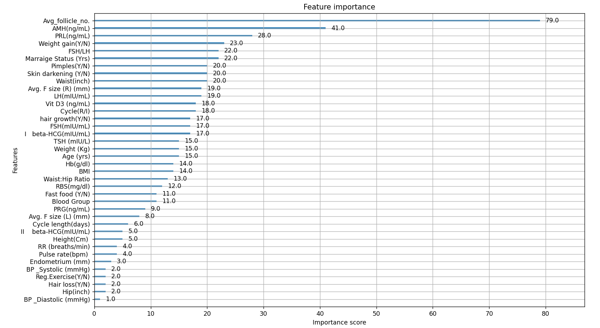

## PCOS: DATA ANALYSIS AND ML PROJECT
Data Analysis and Machine Learning-based PCOS Prediction using Python, Scikit-Learn and XGBoost.

# Dataset Description
This project explores various clinical and hormonal factors linked with Polycystic Ovary Syndrome (PCOS) using data analysis and machine learning methods. The dataset was cleaned, preprocessed, and analysed to identify significant patterns linked to PCOS. Exploratory data analysis (EDA) was performed to find key relations between symptoms and PCOS occurrence. Multiple machine learning models were then trained and evaluated to predict PCOS. Feature importance analysis was lastly used to identify the strongest predictors of the condition.

- Total Records: 541
- Total Features: 45
- Target Variable: PCOS (Y/N)

# Key Features
- PCOS prevalence increased significantly with follicle count.
  It rose from about 5% at 0–2 follicles to nearly 100% at 12 or more follicles. 
- Women with irregular menstrual cycles had up to 83.9% PCOS prevalence, while those with regular cycles had 41.0% to 54.2%. 
- Women with 8–10 follicles, PCOS prevalence was 96.3% when skin darkening was present, compared to only 39.5% when it was absent. 
- In the same group, women reporting weight gain had a PCOS prevalence of 92.6%, while those without weight gain showed a prevalence of 42.1%. 
- With 6–8 follicles, women with excess hair growth had an 81.0% PCOS prevalence, while only 17.2% of those without excess hair growth were affected. 
- The combination of skin darkening and irregular cycles was linked to an 82.9% PCOS prevalence, making it one of the strongest symptom-based indicators. 
- Similarly, the combination of weight gain and irregular cycles showed an 83.9% PCOS prevalence.
- PCOS prevalence among women with skin darkening increased with BMI, reaching 81.0% in the obese category and 55.6% in the underweight category. 
- Women with both high follicle counts (>=10) and skin darkening displayed very high PCOS prevalence, often exceeding 95%. 
- The highest-risk groups showed multiple symptoms, including high follicle count, irregular cycles, skin darkening, and weight gain, with PCOS prevalence nearing 100%.

# Machine Learning Approach
The cleaned dataset was divided into training and testing sets using the usual 80:20 split. The target variable was PCOS (Y/N), while the remaining variables were used as the predictive features.

Three machine learning algorithms were evaluated for their ability to predict PCOS, including:
- Logistic Regression
- XGBoost
- Random Forest

# Model Performance
- Logistic Regression : 86.23
- XGBoost             : 88.07
- Random Forest       : 84.40
  
The XGBoost model achieved the best predictive performance and was hence selected for the feature importance analysis.

# Feature Importance Analysis
Feature importance analysis was performed using the XGBoost model to identify the variables contributing most strongly to PCOS prediction.

Top predictive variables included:

1. Follicle Number
2. AMH (ng/mL)
3. PRL (ng/mL)
4. Weight Gain
5. FSH/LH

# Technologies Used
* Python
* Pandas
* NumPy
* Matplotlib
* Seaborn
* Scikit-Learn
* XGBoost

# Conclusion
This project explored the relationship between clinical, hormonal and lifestyle factors and the occurrence of PCOS. Through Exploratory Data Analysis (EDA) and machine learning techniques, several important predictors of PCOS were identified.

The results demonstrate how data-driven approaches can support the understanding of healthcare conditions and assist in predictive analysis.
